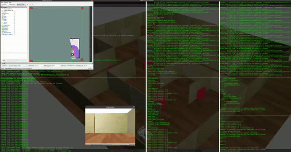
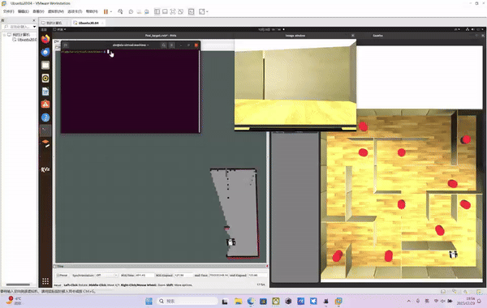

# 活动名称

## 活动简介
该页面主要是23年混杂控制系统课程的活动展示，包括仿真和实物现场汇报。

-----------------------------------------------

## 目录

- [活动名称](#活动名称)
  - [活动简介](#活动简介)
  - [目录](#目录)
  - [仿真展示](#仿真展示)
  - [现场活动](#现场活动)

-----------------------------------------------
## 仿真展示
这里主要展示两个完整的仿真视频，分别是 RRT* 算法和 Frontier based 算法的仿真视频。
    - RRT* 算法完整仿真视频 by 张恒德
    

    

        
        
RRT*-based多目标搜索救援

    

    - Frontier based 算法完整仿真视频 by 谢周
    

    

        
        
Frontier-based多目标搜索救援

    

---------------------------------------------------
## 现场活动
这里主要展示现场活动的照片。
- 活动照 by 刘纬明
    

        

            
            
2023全员照

        

        

            
            
2023年PPT汇报

        

        <!-- 添加更多的图片 -->
        

            
            
2023年实物演示

        

        <!-- ... -->
        

            
            
2023年实物演示

        

    

-----------------------------------------------
- **感谢**
    - RRT* 算法完整仿真视频 by 张恒德
    - Frontier based 算法完整仿真视频 by 谢周
    - 活动照 by 刘纬明